    

# 💫 About Me:

Hello! My name is Harvey Smith, I am a Third-year Computing student @ MTU Kerry  
I build games & interactive software projects using C#/Java 

Currently developing my skills in coding and searching for work placements with the goal of pursuing a career in computers 

# 💻 My Skills:
 
 
 
 
 

 
 
 

# 👾 My Contributions:

<!-- Proudly created with GPRM ( https://gprm.itsvg.in ) -->
